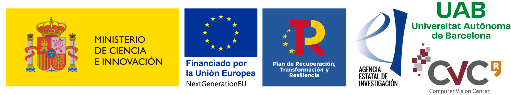

# Guiding Attention in End-to-End Driving Models

<div align="center">

[[Project Page]](https://blog.diegoporres.com/guiding-attention-e2e/) [[Arxiv]](https://arxiv.org/abs/2405.00242) <br>
</div>

-----------------------------------------

## Demo Video
<div align="center">
<video width="1000" controls autoplay loop muted markdown="1">
    <source src="./docs/short_drive.mp4" type="video/mp4">
</video>
</div>

-----------------------------------------

## About

Vision-based end-to-end driving models trained by imitation learning can lead to affordable solutions for autonomous driving. However, training these well-performing models usually requires a huge amount of data, while still lacking explicit and intuitive activation maps to reveal the inner workings of these models while driving. In this paper, we study how to guide the attention of these models to improve their driving quality and obtain more intuitive activation maps by adding a loss term during training using salient semantic maps. In contrast to previous work, our method does not require these salient semantic maps to be available during testing time, as well as removing the need to modify the model's architecture to which it is applied. We perform tests using perfect and noisy salient semantic maps with encouraging results in both, the latter of which is inspired by possible errors encountered with real data. Using CIL++ as a representative state-of-the-art model and the CARLA simulator with its standard benchmarks, we conduct experiments that show the effectiveness of our method in training better autonomous driving models, especially when data and computational resources are scarce.

## Getting started

We will go over the required hardware and software, code installation, data collection and cleanup, and finally on to training your model and validating it.

> [!NOTE]
> This repository inherits the majority of its code from the [CIL++ repository](https://github.com/yixiao1/CILv2_multiview).

### Requirements

 * **Hardware:** A computer with a dedicated GPU capable of running Unreal Engine.
 * **OS:** This code was developed in Ubuntu 22.04. Previous versions should also work, but no other OS was tested.

### Code and CARLA Installation

The easiest way to get started is with [`miniconda`](https://docs.anaconda.com/free/miniconda/). Install it if you don't have it, and run the following to setup the code and environment we will use:

```bash
# Clone this repository
git clone https://github.com/PDillis/guiding-e2e.git
cd guiding-e2e

# Create the environment and install packages
conda create -n cilv2 python=3.7
conda activate cilv2
pip3 install -r requirements.txt
```

Another requirement of the code is to have CARLA `0.9.13` installed locally, as well as its `docker` container. For the former, you can download (and extract) the simulator [here](https://github.com/carla-simulator/carla/releases/tag/0.9.13). For the latter, make sure you have properly installed `docker` and run the following in a terminal:

```bash
docker pull carlasim/carla:0.9.13
```

Remember to follow the [post-installation steps](https://docs.docker.com/engine/install/linux-postinstall/) to remove the need for `sudo`, else our code won't be able to run when collecting data or running evaluations.

### Setting Environment Variables

To run the code, we will need to set some environment variables. Make sure you are *in the root of this repository*:

```bash
export CARLAHOME=/path/to/local/carla  # Root of the local CARLA 0.9.13
export PYTHONPATH=${CARLAHOME}/PythonAPI/carla/:${CARLAHOME}/PythonAPI/carla/dist/carla-0.9.13-py3.7-linux-x86_64.egg:`pwd`/run_CARLA_driving:`pwd`/scenario_runner:`pwd`
export TRAINING_RESULTS_ROOT=`pwd`/VisionTFM  # Change this if you want to use another disk with more space
export DATASET_PATH=/path/to/dataset/root  # Can be general and complemented in the `config.yml` file for the experiment
export SENSOR_SAVE_PATH=${DATASET_PATH}/driving_record  # Recommended to save the evaluation next to your dataset
export DRIVING_TEST_ROOT=`pwd`/run_CARLA_driving/

```

## Data Collection

Refer to the [Data collection](./docs/data_collection.md) guide for how to properly set up the agent that will collect the training and validation data.

## Data Cleanup

Refer to the [Data cleanup](./docs/data_cleanup.md) guide for how to prepare the collected data for training a new agent. 

## Training and Validation

### Experiment Configuration

We will define a configuration file for training a model. In it, we will define the typical training hyperparameters, as well as network setup and training data to use. All of the available configurations are in the [`configs/_global.py`](./configs/_global.py), so if more should be added for training or evaluation, they should also be added there. 

Some experiments are provided in the `configs` directory.

TBD

### Running an experiment

To train the defined experiment above, we can do so either with a single GPU or multiple GPUs. If available, it's recommended to use multiple GPUs in order to accelerate the training.

For a single GPU with ID `0`, we run:

```bash
python3 main.py --process-type=train_val --gpus 0 --folder CILv2 --exp CILv2_3cam_smalltest
```

For multiple GPUs, we need their IDs and total number of GPUs. For example, in a cluster with many GPUs, we wish to use three GPUs with IDs `0,3,5`, so we run:

```bash
torchrun --nproc_per_node=3 main.py --gpus 0,3,5 --folder CILv2 --exp CILv2_3cam_smalltest
```

Results will be saved in the `TRAINING_RESULTS_ROOT` directory, separated by `folder` and `experiment`, that is, `$TRAINING_RESULTS_ROOT/_results/{folder}/{exp}`. 

### Running validation

Finally, in order to 

#### `NoCrash`

For models trained with single lane data, we typically test their capabilites using the `NoCrash` benchmark defined in the [CILRS paper](https://arxiv.org/abs/1904.08980). Basically, we define some routes that the model should complete within a certain time limit, and should a crash be detected, we stop the 

To run the `NoCrash` benchmark, we have defined some scripts. There are two maps available, each with different scenarios (number of agents roaming in the map):

| | **`Town01`** | **`Town02`** |
| --- |   ---    |    ---   |
| **Scenario** | `empty`, `regular`, `dense` | `empty`, `regular`, `busy` |

Thus, if we wish to run the `NoCrash` benchmark in `Town01` under new weather conditions with a `regular` scenario for the checkpoint `45` of the `CILv2_3cam_smalltest` experiment above, using the GPU with ID `0`, we run the following:

```bash
./run_CARLA_driving/scripts/run_evaluation/CILv2/nocrash_newweather_Town01_lbc.sh 0 CILv2 CLIv2_3cam_smalltest 45 regular
```

Note that this allows you to run multiple checkpoints in parallel using different GPUs, should they be available. The results of the driving will be saved in `./run_CARLA_driving/results` (Route Completion, Driving Score, etc.). By default, a random seed of `0` will be used to spawn and control the other agents, but we can change this to another one by e.g. adding `--random-seed 42` in the above command. 

If you wish to save the driving during this evaluation (such as the one in the [demo video](#demo-video)), then you also need to add the flag  `--save-driving-vision`. This will save each frame to the `$SENSOR_SAVE_PATH` defined above. Naturally, this will make the driving run much slower, so use it for models you wish to better visualize.

For running the benchmark in `Town02`, the command will be the same, but the script to be run is:

```bash
./run_CARLA_driving/scripts/run_evaluation/CILv2/nocrash_newweathertown_Town02_lbc.sh 0 CILv2 CLIv2_3cam_smalltest 45 regular --random-seed 42 --save-driving-vision
```

#### Offline Leaderboard


## Citation

Should you find this work useful, please cite (to be updated with the IV citation):

```bibtex
@misc{porres2024guiding,
      title={Guiding Attention in End-to-End Driving Models}, 
      author={Diego Porres and Yi Xiao and Gabriel Villalonga and Alexandre Levy and Antonio M. López},
      year={2024},
      eprint={2405.00242},
      archivePrefix={arXiv},
      primaryClass={cs.CV}
}
```

## Acknowledgements

This research is supported by project TED2021-132802BI00 funded by MCIN/AEI/10.13039/501100011033 and the European Union NextGenerationEU/PRTR. Antonio M. Lopez acknowledges the financial support to his general research activities given by ICREA under the ICREA Academia Program. Antonio and Gabriel thank the synergies, in terms of research ideas, arising from the project PID2020-115734RB-C21 funded by MCIN/AEI/10.13039/501100011033. The authors acknowledge the support of the Generalitat de Catalunya CERCA Program and its ACCIO agency to CVC’s general activities.

<div align="center">
 
</div>