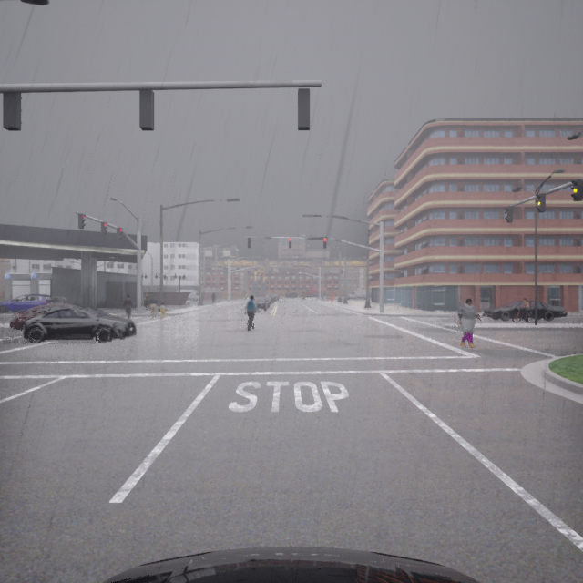
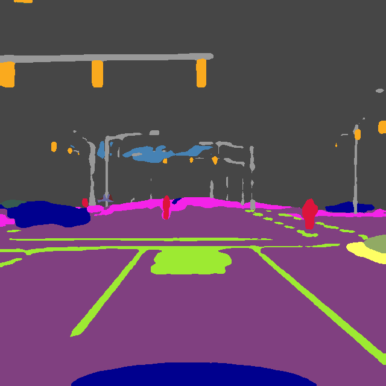
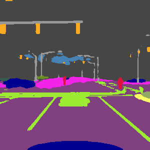

# Data Preparation

After [properly collecting a dataset](./data_collection.md), it must be prepared so that we may train a model with it. This implies multiple parts, which we explain in the following:

> [!NOTE]
> Given that we usually deal with a large amount of file numbers, we use multithreading in the majority of the following code (except for [deleting files](#clean-route)). We do this via using either [`multiprocessing`](https://docs.python.org/3/library/multiprocessing.html) or [`concurrent.futures`](https://docs.python.org/3/library/concurrent.futures.html). Please refer to their documentation for more information.

## Fix the driving command

This is the first thing that should be done. The command given to the ego vehicle during data collection (i.e., follow the lane, turn left, turn right, etc.) is sometimes given too late, which may lead to a model not performing the action in time. 

To fix this, we can see where the command was given and rewrite the CAN bus data so that this command is given some seconds before. We do this by running:

```bash
python3 data_analysis/data_tools.py command-fix --dataset-path=/path/to/your/dataset
```

This will create for each `can_bus%06d.json` file a new `cmd_fix_can_bus%06d.json` file, which we will use for training.

## Offline resizing of RGB images

If the collected images are at a higher resolution than what we wish to train the model with, we can resize them offline so that training takes less time. We do so by running:

```bash
python3 data_analysis/data_tools.py resize-dataset --dataset-path=/path/to/your/dataset --res=300x300 --img-ext=png --processes-per-cpu=1
```

This will create, for each of the RGB images in the dataset, an equivalent one with same frame number and image extension. For example, if we have `rgb_central001900.png` at resolution `640x640`, the command above will create `resized_rgb_central001900.png` at `300x300` resolution. The number of processes should speed things up, but these will depend on your hardware configuration. By default, we launch one process per available CPU core.

|  `rgb_central001900.png` |  `resized_rgb_central001900.png` |
| --- | --- |
|  |  |


## Visualize the routes

We can visualize the routes in the dataset and create individual videos of them to more easily see if the collected data has some faults, or if they need to be rerun. To create the videos, run:

```bash
python3 data_analysis/data_tools.py visualize-routes --dataset-path=/path/to/your/dataset --fps=20 --camera-name=resized_rgb --processes-per-cpu=1
```

If we don't specify the output directory (`--out`), then the script will create a `videos` subdirectory in the provided `--dataset-path`. An example of the created videos in a dataset collected in `Town04` with `WetNoon` weather condition is shown here:

[Town04_R11_WN](https://github.com/PDillis/guiding-e2e/assets/24496178/ec276372-80de-4130-837d-9d0eeb2d4147)


We will have the most important information read from the `cmd_fix_can_bus` data: at the top, the frame number, current command to follow, and current speed in meters per second. In the bottom are the two actions we will learn to predict: the steering angle and acceleration (the latter being the difference between the throttle and brake values in the can bus data). 

This step is useful if we wish to verify the collected data is correct, or if we should remove specific frames. We do this in the following section.

## Clean Route

Sometimes there are frames where the ego vehicle is not performing well, whether by mistake or design. For example, the Roach agent used to collect data has access to privileged information, sometimes leading to behavior that cannot be explained by the information that the cameras provide. Perhaps the more egregious behavior is colliding with other vehicles or pedestrians, which we do not wish our model should learn to mimic.

We can annotate which frames this happens at (or ranges of frames) when we [visualize the routes](#visualize-the-routes) above, and remove them via the following script:

```bash
python3 data_analysis/data_tools.py clean-route --route-path=/path/to/your/dataset/route --remove-ticks=90-1020,1500-1700
```

In the above command, all of the data that have ticks in the ranges `[90, 1020]` and `[1500, 1700]` (note the endpoints are inclusive) in the given `--route-path` will be removed. This includes RGB, depth, can_bus, etc., basically any sensor in the dataset. On the other hand, if we pass an integer like `--remove-ticks=205`, this will remove all the data with ticks in the range `[0, 205)` (note it's non-inclusive). Due to the fact you are deleting data, the script above will ask for you to input `yes`, along showing the amount of files that will be deleted when running the script (not the amount of frames, but the amount of data).

## Synthetic Attention Mask Generation

### New dataset

To create the *synthetic attention masks* explained in the paper, we must collect a semantic segmentation and depth images for each frame and for each RGB sensor. Please be mindful to collect these sensors in the [data collection](./data_collection.md) step. 

#### Fixing semantic segmentation

Sometimes, previously-collected datasets may contain a semantic segmentation masks that don't have the Cityscapes palette, but instead have only the [class value encoded in the red channel](https://carla.readthedocs.io/en/0.9.13/ref_sensors/#semantic-segmentation-camera). To fix this we have a small script that must be run for all datasets that present this error:


```bash
python3 data_analysis/data_tools.py prepare-ss --dataset-path=/path/to/your/dataset --processes-per-cpu=1
```

If we wish to print more to the console, we can add the `--debug` flag in the above command. This should result in the modification of all semantic segmentation images to follow the Cityscapes palette as follows:


#### Getting the masks

With the collected RGB, semantic segmentation, and depth images, we can proceed to create the *synthetic attention masks*. We have thus defined the following script:

```bash
python3 data_analysis/data_tools.py create-virtual-attentions --dataset-path=/path/to/your/dataset --max-depth=20.0 --min-depth=2.3 --processes-per-cpu=1
```

If we provide either (or both) of `--max-depth` and `--min-depth`, then we will use the depth cameras to create binary masks for objects that are within these ranges. The default value of `--min-depth=2.3` will filter out the hood of the ego vehicle, but this should be fixed should the vehicle model is changed (we use the `"vehicle.lincoln.mkz_2017"`). 

For single-lane maps such as `Town01` and `Town02`, we use `--max-depth=20.0`, whereas for more complex maps with wider intersections, we set `--max-depth=40.0`. Note that this is not a parameter we tuned via experiments, so more work could be done here.

Lastly, we can create imperfect masks by adding a `--noise-cat`. There are four options: 
 * `--noise-cat=0` will not add any noise 
 * `--noise-cat=1` will add a global grid Perlin noise to the whole mask
 * `--noise-cat=2` will add a grid Perlin noise on large objects and Perlin noise on lines
 * `--noise-cat=3` will add a global Perlin noise on the whole mask

We settled with `--noise-cat=2` for our experiments, as we feel is the most naturally occurring in real data (that is, it doesn't make sense to add granular noise to fine lines). Some samples of the mask with different types of noise are shown in the following:

| `--noise-cat=0` | `--noise-cat=1` | `--noise-cat=2` | `--noise-cat=3` |
| :-: | :-: | :-: | :-: |
|  | TODO | TODO | TODO |

### Inference with pre-trained models

Alternatively, we may make use of pre-trained models for obtaining the semantic segmentation masks of a previously collected dataset. This can be easily done with the [`transformers`](https://huggingface.co/docs/transformers/en/index) library and its myriad of available pre-trained models. We will focus on using the [Mask2Former](https://arxiv.org/abs/2112.01527), since it offers a pre-trained checkpoint on the [Mapillary Vistas](https://www.mapillary.com/dataset/vistas) dataset, which contains many classes of interest. You can find more documentation of the released model [here](https://huggingface.co/docs/transformers/model_doc/mask2former). 

To easily create the semantic segmentations for a dataset (real or synthetic), we can do so with the following command:

```bash
python3 data_analysis/data_tools.py predict-ss --dataset-path=/path/to/your/dataset --rgb-prefixes resized_rgb --save-name-prefix ss_hat --extension .png --num-workers 4
```

The `--rgb-prefixes` will be the prefix for the RGB file-names that the model will look to infer from. The `--save-name-prefix` will be the prefix of the saved semantic segmentation file which is set to `"ss_hat"` by default, in case the `"ss"` files exist beforehand. The `--extension` option will let you select an extension of the semantic segmentation images, but it is recommended to keep it as `.png`. 

TBD: batch size

In a nutshell, the code does the following: 
    
1. We infer the semantic segmentation image with the pre-trained model
2. Translate the labels from Mapillary to Cityscapes (using some pre-defined switches; found in `data_analysis/data_tools.py`)
3. Set up a black starting image and replace each label to the corresponding RGB value in the Cityscapes palette

For a single sample, this is done like so:

```python
import transformers
import torch
import numpy as np
from PIL import Image
from transformers import AutoImageProcessor, Mask2FormerForUniversalSegmentation
from data_analysis.data_tools import id2label_mapillary, mapillary_to_cityscapes, label2rgb_cityscapes

processor = AutoImageProcessor.from_pretrained("facebook/mask2former-swin-large-mapillary-vistas-semantic")
model = Mask2FormerForUniversalSegmentation.from_pretrained("facebook/mask2former-swin-large-mapillary-vistas-semantic")

image = Image.open("./sample_data/resized_rgb_central001900.png")
inputs = processor(images=image, return_tensors="pt")

with torch.no_grad():
    outputs = model(**inputs)

# Get the 2D semantic segmentation
prediction = processor.post_process_semantic_segmentation(outputs, target_sizes=[image.size[::-1]])[0]

# Define a black starting image
pred_ss = np.zeros((*prediction.shape, 3), dtype=np.uint8)

for mapillary_id, label in id2label_mapillary.items():
    cityscapes_label = mapillary_to_cityscapes.get(label, 'None')
    rgb = label2rgb_cityscapes[cityscapes_label]
    pred_ss[prediction == mapillary_id] = rgb

Image.fromarray(pred_ss).show()  # We usually save this with the corresponding name
```

We showcase the ground-truth semantic segmentation obtained from CARLA at `640x640` resolution, and the two semantic segmentations obtained from the corresponding RGB images at `640x640` and `300x300` resolution with the Mask2Former model (that is, inferring from `rgb_central001900.png` and `resized_rgb_central001900.png`, respectively):

| `ss_central001900.png` (`640x640`, GT) | `ss_hat_central001900.png` (`640x640`) | `ss_hat_resized_central001900.png` (`300x300`) |
|:-: | :-: | :-: |
|  |  |  |